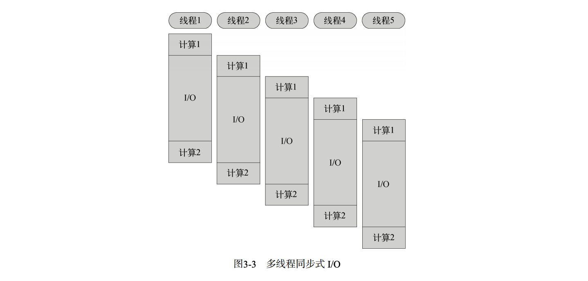
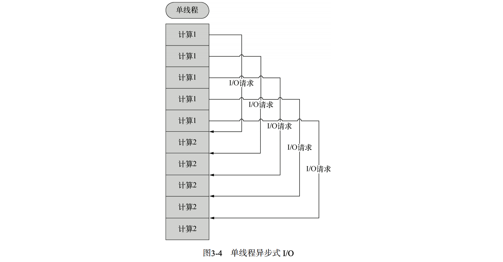

#### 浏览器兼容性问题的造成 

尽管有 ECMAScript 作为 JavaScript 的语法和语言特性标准，但是关于 JavaScript 其他方 面的规范还是不明确，同时不同浏览器又加入了各自特有的对象、函数。这也就是为什么这 么多年来同样的 JavaScript 代码会在不同的浏览器中呈现出不同的效果，甚至在一个浏览器 中可以执行，而在另一个浏览器中却不可以。 要注意的是，浏览器的兼容性问题并不只是由 JavaScript 的兼容性造成的，而是 DOM、 BOM、CSS 解析等不同的行为导致的。


#### commonjs

CommonJS 试图定义一套普通应 用程序使用的API，从而填补 JavaScript 标准库过于简单的不足。CommonJS 的终极目标是 制定一个像 C++ 标准库一样的规范，使得基于 CommonJS API 的应用程序可以在不同的环 境下运行，就像用 C++ 编写的应用程序可以使用不同的编译器和运行时函数库一样。为了 保持中立，CommonJS 不参与标准库实现，其实现交给像 Node.js 之类的项目来完成。图1-5 是 CommonJS 的各种实现。

CommonJS 规范包括了模块（modules）、包（packages）、系统（system）、二进制（binary）、 控制台（console）、编码（encodings）、文件系统（filesystems）、套接字（sockets）、单元测 试（unit testing）等部分。


**使用命令行执行语句，如输出内容**：`node -e console.log('node -e 后输入需要执行的语句')`


####  REPL 模式

运行无参数的 node 将会启动一个 JavaScript 的交互式 shell

```shell
$ node
> console.log('Hello World');
Hello World
undefined
> consol.log('Hello World');
ReferenceError: consol is not defined
 at repl:1:1
 at REPLServer.eval (repl.js:80:21)
 at repl.js:190:20
 at REPLServer.eval (repl.js:87:5)
 at Interface.<anonymous> (repl.js:182:12)
 at Interface.emit (events.js:67:17)
 at Interface._onLine (readline.js:162:10)
 at Interface._line (readline.js:426:8)
 at Interface._ttyWrite (readline.js:603:14)
 at ReadStream.<anonymous> (readline.js:82:12) 
```

进入 REPL 模式以后，会出现一个“>”提示符提示你输入命令，输入后按回车，Node.js 将会解析并执行命令。

如果你执行了一个函数，那么 REPL 还会在下面显示这个函数的返回 值，上面例子中的 undefined 就是 console.log 的返回值。

如果你输入了一个错误的 指令，REPL 则会立即显示错误并输出调用栈。

**退出 Node.js 的 REPL 模式** 在任何时候，连续按两次 Ctrl + C 即可。


#### supervisor实时监听

安装

```shell
$ npm install -g supervisor
```

启动

```shell
$ supervisor app.js
```


####  同步式 I/O 和异步式 I/O 

什么是阻塞（block）呢？线程在执行中如果遇到磁盘读写或网络通信（统称为 I/O 操作）， 通常要耗费较长的时间，这时操作系统会剥夺这个线程的 CPU 控制权，使其暂停执行，同 时将资源让给其他的工作线程，这种线程调度方式称为 阻塞。当 I/O 操作完毕时，操作系统 将这个线程的阻塞状态解除，恢复其对CPU的控制权，令其继续执行。这种 I/O 模式就是通 常的同步式 I/O（Synchronous I/O）或阻塞式 I/O （Blocking I/O）。

 相应地，异步式 I/O （Asynchronous I/O）或非阻塞式 I/O （Non-blocking I/O）则针对 所有 I/O 操作不采用阻塞的策略。当线程遇到 I/O 操作时，不会以阻塞的方式等待 I/O 操作 的完成或数据的返回，而只是将 I/O 请求发送给操作系统，继续执行下一条语句。当操作 系统完成 I/O 操作时，以事件的形式通知执行 I/O 操作的线程，线程会在特定时候处理这个 事件。为了处理异步 I/O，线程必须有事件循环，不断地检查有没有未处理的事件，依次予 以处理。 

阻塞模式下，一个线程只能处理一项任务，要想提高吞吐量必须通过多线程。而非阻塞 模式下，一个线程永远在执行计算操作，这个线程所使用的 CPU 核心利用率永远是 100%， I/O 以事件的方式通知。在阻塞模式下，多线程往往能提高系统吞吐量，因为一个线程阻塞 时还有其他线程在工作，多线程可以让 CPU 资源不被阻塞中的线程浪费。而在非阻塞模式 下，线程不会被 I/O 阻塞，永远在利用 CPU。多线程带来的好处仅仅是在多核 CPU 的情况 下利用更多的核，而Node.js的单线程也能带来同样的好处。这就是为什么 Node.js 使用了单 线程、非阻塞的事件编程模式。







单线程事件驱动的异步式 I/O 比传统的多线程阻塞式 I/O 究竟好在哪里呢？简而言之， 异步式 I/O 就是少了多线程的开销。对操作系统来说，创建一个线程的代价是十分昂贵的， 需要给它分配内存、列入调度，同时在线程切换的时候还要执行内存换页，CPU 的缓存被 清空，切换回来的时候还要重新从内存中读取信息，破坏了数据的局部性。① 当然，异步式编程的缺点在于不符合人们一般的程序设计思维，容易让控制流变得晦涩 难懂，给编码和调试都带来不小的困难。习惯传统编程模式的开发者在刚刚接触到大规模的异 步式应用时往往会无所适从，但慢慢习惯以后会好很多。尽管如此，异步式编程还是较为困难， 不过可喜的是现在已经有了不少专门解决异步式编程问题的库（如async）


| : 同步式 I/O（阻塞式）              | :异步式 I/O（非阻塞式）    |
| ----------------------------------- | -------------------------- |
| 利用多线程提供吞吐量                | 单线程即可实现高吞吐量     |
| 通过事件片分割和线程调度利用多核CPU | 通过功能划分利用多核CPU    |
| 需要由操作系统调度多线程使用多核    | CPU 可以将单进程绑定到单核 |
| CPU 难以充分利用                    | CPU 资源 可以充分利用      |
| CPU 资源 内存轨迹大，数据局部性弱   | 内存轨迹小，数据局部       |
| 符合线性的编程思维                  | 不符合传统编程思维         |

 

#### 模块和包

##### 模块

模块是 Node.js 应用程序的基本组成部分，文件和模块是一一对应的。换言之，一个 Node.js 文件就是一个模块，这个文件可能是 JavaScript 代码、JSON 或者编译过的 C/C++ 扩展。 在前面章节的例子中，我们曾经用到了 var http = require('http')，其中 http 是 Node.js 的一个核心模块，其内部是用 C++ 实现的，外部用 JavaScript 封装。我们通过 require 函数获取了这个模块，然后才能使用其中的对象。

**注意** exports 直接赋值代替对 module.exports 赋值。 exports 实际上只是一个和 module.exports 指向同一个对象的变量， 它本身会在模块执行结束后释放，但 module 不会，因此只能通过指定 module.exports 来改变访问接口。


##### 包

Node.js 根 据 CommonJS 规范实现了包机制，开发了 npm来解决包的发布和获取需求。

Node.js 的包是一个目录，其中包含一个 JSON 格式的包说明文件 package.json。严格符 合 CommonJS 规范的包应该具备以下特征：

-  package.json 必须在包的顶层目录下； 
-  二进制文件应该在 bin 目录下； 
-  JavaScript 代码应该在 lib 目录下； 
-  文档应该在 doc 目录下； 
-  单元测试应该在 test 目录下。

###### package.json

Node.js 在调用某个包时，会首先检查包中 package.json 文件的 main 字段，将其作为
包的接口模块，如果 package.json 或 main 字段不存在，会尝试寻找 index.js 或 index.node 作
为包的接口。

package.json 是 CommonJS 规定的用来描述包的文件，完全符合规范的 package.json 文
件应该含有以下字段。
 name：包的名称，必须是唯一的，由小写英文字母、数字和下划线组成，不能包含
空格。
 description：包的简要说明。
 version：符合语义化版本识别①规范的版本字符串。
 keywords：关键字数组，通常用于搜索。
 maintainers：维护者数组，每个元素要包含 name、email（可选）、web（可选）
字段。
 contributors：贡献者数组，格式与maintainers相同。包的作者应该是贡献者
数组的第一个元素。
 bugs：提交bug的地址，可以是网址或者电子邮件地址。
 licenses：许可证数组，每个元素要包含 type （许可证的名称）和 url （链接到
许可证文本的地址）字段。
 repositories：仓库托管地址数组，每个元素要包含 type （仓库的类型，如 git ）、
url （仓库的地址）和 path （相对于仓库的路径，可选）字段。
 dependencies：包的依赖，一个关联数组，由包名称和版本号组成。

```
{
 "name": "mypackage",
 "description": "Sample package for CommonJS. This package demonstrates the required
elements of a CommonJS package.",
 "version": "0.7.0",
 "keywords": [
 "package",
 "example"
 ],
 "maintainers": [
 {
 "name": "Bill Smith",
 "email": "bills@example.com",
 }
 ],
 "contributors": [
 {
 "name": "BYVoid",
 "web": "http://www.byvoid.com/"
 }
 ],
 "bugs": {
 "mail": "dev@example.com",
 "web": "http://www.example.com/bugs"
 },
 "licenses": [
 {
 "type": "GPLv2",
 "url": "http://www.example.org/licenses/gpl.html"
 }
 ],
 "repositories": [
 {
 "type": "git",
 "url": "http://github.com/BYVoid/mypackage.git"
 }
 ],
 "dependencies": {
 "webkit": "1.2",
 "ssl": {
 "gnutls": ["1.0", "2.0"],
 "openssl": "0.9.8"
 }
 }
} 
```

###### Node.js 包管理器

Node.js包管理器，即npm是 Node.js 官方提供的包管理工具，它已经成了 Node.js 包的 标准发布平台，用于 Node.js 包的发布、传播、依赖控制。npm 提供了命令行工具，使你可 以方便地下载、安装、升级、删除包，也可以让你作为开发者发布并维护包。

1. 获取一个包 使用 npm 安装包的命令格式为：

   ```
   npm [install/i] [package_name] 
   ```

2. 本地模式和全局模式

   在使用 npm 安装包的时候，有两种模式：本地模式和全局模式。默认情况下我们使用 npm install命令就是采用本地模式，即把包安装到当前目录的 node_modules 子目录下。Node.js 的 require 在加载模块时会尝试搜寻 node_modules 子目录，因此使用 npm 本地模式安装 的包可以直接被引用。 npm 还有另一种不同的安装模式被成为全局模式，使用方法为：

   ```
   npm [install/i] -g [package_name] 
   ```

   **使用全局模式的原因：** 多数时候并不是因为许多程序都有可能用到它，为了减少多重副本而使用全局模式，而是因为本地模式不会注册 PATH 环境变量。举例说明，我们安装 supervisor 是为了在命令行中运行它，譬如直接运行 supervisor script.js，这时就需要在 PATH 环境变量中注册 supervisor。npm 本地模式仅仅是把包安装到 node_modules 子目录下，其中 的 bin 目录没有包含在 PATH 环境变量中，不能直接在命令行中调用。而

###### 创建/发布包

**创建：** 创建一个目录，在这个目录下运行`npm init`，创建一个符合npm规范的package.json文件，创建一个 index.js 作为包的接口，一个简单的包就制作完成了。

**账号密码**：在发布前，我们还需要获得一个账号用于今后维护自己的包，使用 npm adduser 根据 提示输入用户名、密码、邮箱，等待账号创建完成。完成后可以使用 npm whoami 测验是 否已经取得了账号。

**发布**：接下来，在 package.json 所在目录下运行 `npm publish`，稍等片刻就可以完成发布了。 打开浏览器，访问 http://search.npmjs.org/ 就可以找到自己刚刚发布的包了。现在我们可以在 世界的任意一台计算机上使用 `npm install byvoidmodule` 命令来安装它。

**更新和取消发布：**如果你的包将来有更新，只需要在 package.json 文件中修改 version 字段，然后重新 使用 npm publish 命令就行了。如果你对已发布的包不满意（比如我们发布的这个毫无意 义的包），可以使用 npm unpublish 命令来取消发布。


#### 调试

使用`--inspect`直接调试运行脚本

```
node --inspect debug.js
```

有时脚本较小，还未打开工具就运行完成了，此时可以使用`--inspect-brk`设置在第一行就打断点。`=9229`是设置端口号

```
node --inspect-brk=9229 app.js
```


### node.js核心模块

 全局对象；  常用工具；  事件机制；  文件系统访问；  HTTP 服务器与客户端。

#### 全局对象

##### 全局对象global

JavaScript 中有一个特殊的对象，称为全局对象（Global Object），它及其所有属性都可 以在程序的任何地方访问，即全局变量。在浏览器 JavaScript 中，通常 window 是全局对象， 而 Node.js 中的全局对象是 **global**，所有全局变量（除了 global 本身以外）都是 global 对象的属性。

##### process

process 是一个全局变量，即 global 对象的属性。它用于描述当前 Node.js 进程状态 的对象，提供了一个与操作系统的简单接口。

- `process.argv`命令行参数数组，第一个元素是 node，第二个元素是脚本文件名， 从第三个元素开始每个元素是一个运行参数。

  ```
  $ node some.js 1991 name=b --v "car"
  > [ 'node',
   '/home/byvoid/argv.js',
   '1991',
   'name=byvoid',
   '--v',
   'Carbo Kuo' ] 
  ```

- `process.stdout`是标准输出流，通常我们使用的 console.log() 向标准输出打印 字符，而 process.stdout.write() 函数提供了更底层的接口。

- `process.stdin`是标准输入流，初始时它是被暂停的，要想从标准输入读取数据， 你必须恢复流，并手动编写流的事件响应函数。

  ```
  process.stdin.resume();
  process.stdin.on('data', function(data) {
   process.stdout.write('read from console: ' + data.toString());
  }); 
  ```

- `process.nextTick(callback)`的功能是为事件循环设置一项任务，Node.js 会在 下次事件循环调响应时调用 callback。

##### console

```javascript
console.log('Hello world');	// Hello world
console.log('byvoid%diovyb');	// byvoid%diovyb
console.log('byvoid%diovyb', 1991); 	// byvoid1991iovyb
```

**console.log()**：向标准输出流打印字符并以换行符结束。

**console.error()**：与 console.log() 用法相同，只是向标准错误流输出。 

**console.trace()**：向标准错误流输出当前的调用栈。


##### 常用工具 util

**util.inherits：**是一个实现对象间原型继承 的函数。

```javascript
var util = require('util');
function Base() {
	this.name = 'base';
	this.base = 1991;

	this.sayHello = function() {
		console.log('Hello ' + this.name);
	};
}
Base.prototype.showName = function() {
	console.log(this.name); 
};
function Sub() {
	this.name = 'sub';
}
util.inherits(Sub, Base);

var objBase = new Base();
objBase.showName();
objBase.sayHello();
console.log(objBase);

var objSub = new Sub();
objSub.showName();
//objSub.sayHello();
console.log(objSub); 
```

只继承原型上的方法；

⚠️ 原型上的方法无法被console.log出来


